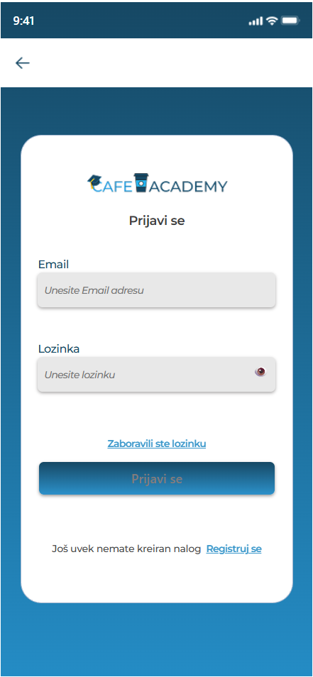
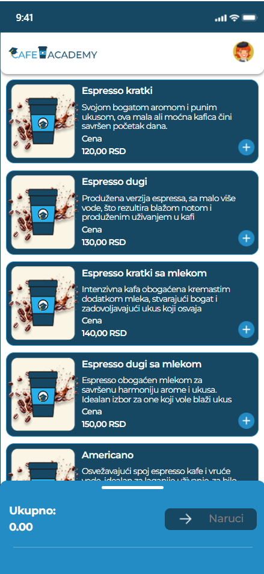
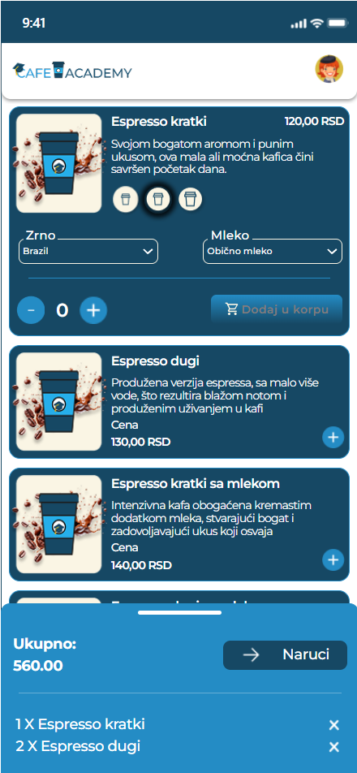
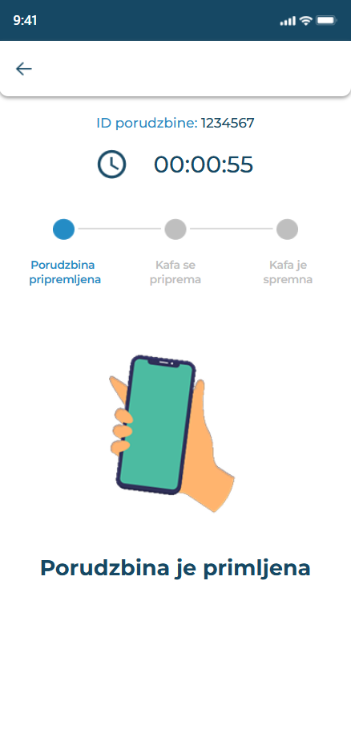
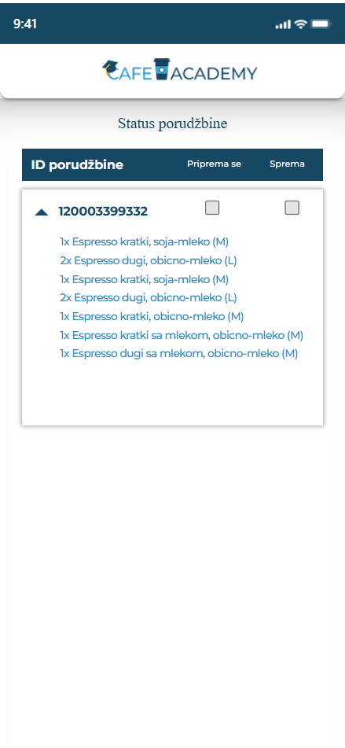

# Coffee Shop Web App

Frontend web application built with React.
The project represents a coffee shop website with a focus on UI, layout and component structure.

---

## 🤝 Collaboration
This project was developed collaboratively with a colleague
as part of a learning and practice project.

---

## ✨ Features
- Single-page application (SPA)
- Component-based architecture
- Structured and reusable UI components
- Product / menu presentation
- Login and registration UI (frontend only)
- Form handling and basic input validation
- Clear separation of sections (hero, menu, about, contact)
  
---

## 🔐 Authentication (Frontend Only)
- Login and registration flow implemented on the frontend
- No backend or database connection
- Project focuses on UI logic and user experience

---

## 🛠 Tech Stack
- React
- JavaScript (ES6+)
- HTML
- CSS

---

## ☕ About the Project
Coffee Shop Web App was built as a learning project to practice:
- React fundamentals
- Working with components and props
- Building a complete UI-focused web application
- Structuring a real-world website layout

---

## 📸 Screenshots

  
  
  
  
  
  
  

